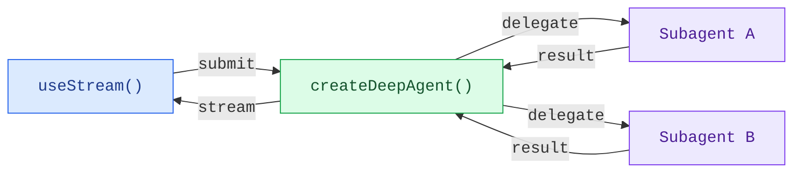

Build frontends that visualize deep agent workflows in real time. These patterns show how to render subagent progress, task planning, and streaming content from agents created with `createDeepAgent`.

## Architecture

Deep agents use a coordinator-worker architecture. The main agent plans tasks and delegates to specialized subagents, each running in isolation. On the frontend, `useStream` surfaces both the coordinator's messages and each subagent's streaming state.



:::python

```python
from deepagents import create_deep_agent

agent = create_deep_agent(
    tools=[get_weather],
    system_prompt="You are a helpful assistant",
    subagents=[
        {
            "name": "researcher",
            "description": "Research assistant",
        }
    ],
)
```

:::

:::js

```ts
import { createDeepAgent } from "deepagents";

const agent = createDeepAgent({
  tools: [getWeather],
  system: "You are a helpful assistant",
  subagents: [
    {
      name: "researcher",
      description: "Research assistant",
    },
  ],
});
```

:::

On the frontend, connect with `useStream` the same way as with `createAgent`. Deep agent patterns use additional `useStream` features like `stream.subagents`, `stream.values.todos`, and `filterSubagentMessages` to render subagent-specific UIs.

```ts
import { useStream } from "@langchain/react";

function App() {
  const stream = useStream<typeof agent>({
    apiUrl: "http://localhost:2024",
    assistantId: "agent",
  });

  // Deep agent state beyond messages
  const todos = stream.values?.todos;
  const subagents = stream.subagents;
}
```

## Patterns

<CardGroup cols={2}>
  <Card title="Subagent streaming" icon="arrows-split" href="/oss/deepagents/frontend/subagent-streaming">
    Display specialist subagents with streaming content, progress tracking, and collapsible cards.
  </Card>
  <Card title="Todo list" icon="list-check" href="/oss/deepagents/frontend/todo-list">
    Track agent progress with a real-time todo list synced from agent state.
  </Card>
</CardGroup>

## Related patterns

The [LangChain frontend patterns](/oss/langchain/frontend/overview), including
markdown messages, tool calling, and human-in-the-loop, all work with deep
agents too. Deep agents are built on the same LangGraph runtime, so
`useStream` provides the same core API.
